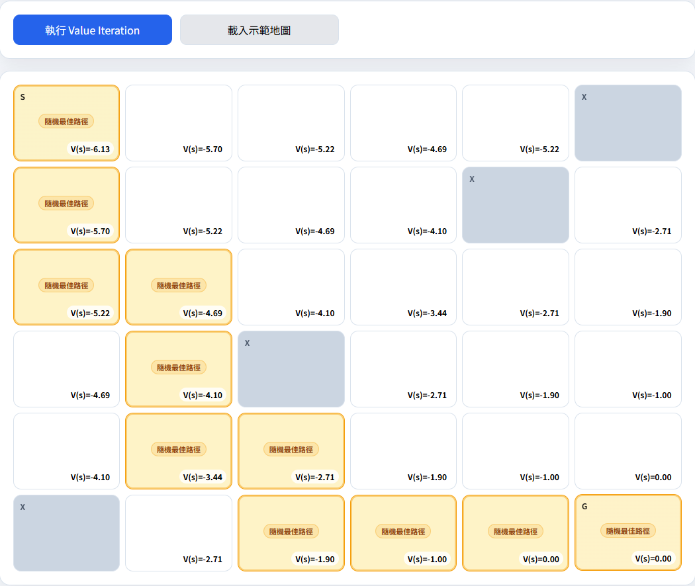

# GridWorld Value Iteration (GitHub Pages 版)


## Live Demo
GitHub Pages: https://GH-YUXI.github.io/HW1-GridWorld/



## 特色

- 使用 Value Iteration 計算最佳狀態價值 `V(s)`
- 根據收斂後的 `V(s)` 萃取最佳策略箭頭
- 可設定：
  - `n x n` Grid（5 到 9）
  - 起點 / 終點 / 障礙物
  - 步驟獎勵 `Reward` 設定為-1
  - 折扣因子 `γ` 設定為0.9
- 同分狀態下隨機選擇最佳路徑

## 檔案結構

```text
.
├── index.html
├── README.md
└── static
    ├── app.js
    └── style.css
```

## 本機測試

直接用瀏覽器開 `index.html` 即可，或用任何靜態伺服器開啟。

## Value Iteration 核心

對每個非終點、非障礙的 state，反覆更新：

```text
V(s) = max_a [ R(s,a,s') + γV(s') ]
```

收斂後再用每個 state 的最大 action value 萃取最佳策略。
